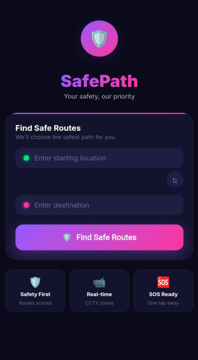
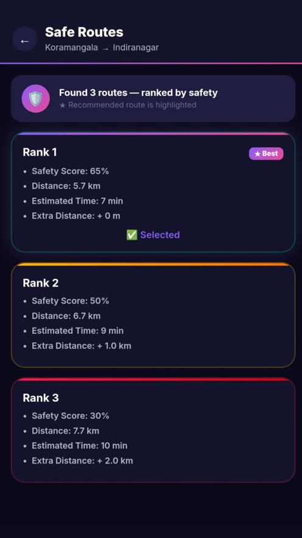

# 🛡️ HerPath — SafePath AI
Smartwatch-Based Safe Navigation System for Women  
*"Because Safety Should Never Wait."*

---

## 📌 Overview
Women face real safety concerns when navigating unfamiliar routes — especially at night or in isolated areas.  
Traditional maps prioritize speed, not safety. Shortest routes often pass through poorly lit, low-foot-traffic, or high-risk areas with no safety context.  

**HerPath** is an intelligent navigation app powered by Machine Learning that recommends the safest route — not just the fastest — with real-time guidance delivered directly to a mobile and smartwatch.

---

## 🚨 The Problem
- Shortest routes often pass through poorly lit or isolated areas  
- Existing navigation apps provide no safety context  
- Women have no reliable tool to assess risk along a route in real-time  

---

## ✅ Our Solution
An AI-powered navigation system that:
- Analyzes multiple safety parameters along potential routes  
- Uses ML to rank and recommend the safest path  
- Delivers haptic and visual alerts via a smartwatch  

**Safety Parameters Used**
- 📷 CCTV Coverage  
- 💡 Street Lighting  
- 🚔 Police Proximity  
- 🚌 Bus Stop Density  

---
## 📱 SafePath App Screenshots

### Home Screen
 

### Safe Routes Result

## 🚀 How It Works
1. User opens the app and enters their destination  
2. The AI Safety Engine fetches real-time data (CCTV, lighting, crowd, crime)  
3. ML model ranks routes by safety score  
4. Safest route is selected and transferred to the smartwatch  
5. Smartwatch provides navigation via haptic and visual alerts  
